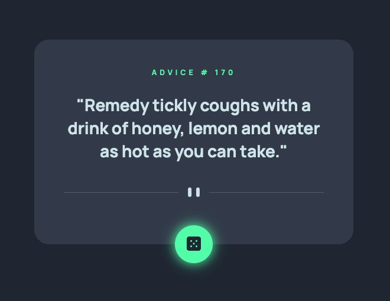

# Frontend Mentor - Advice generator app solution

This is a solution to the [Advice generator app challenge on Frontend Mentor](https://www.frontendmentor.io/challenges/advice-generator-app-QdUG-13db). Frontend Mentor challenges help you improve your coding skills by building realistic projects.

## Table of contents

- [Overview](#overview)
  - [The challenge](#the-challenge)
  - [Screenshot](#screenshot)
- [My process](#my-process)
  - [Built with](#built-with)
  - [What I learned](#what-i-learned)

**Note: Delete this note and update the table of contents based on what sections you keep.**

## Overview

### The challenge

Users should be able to:

- View the optimal layout for the app depending on their device's screen size
- See hover states for all interactive elements on the page
- Generate random advice

### Screenshot



### Built with

- Html
- Scss
- Javascript
- Webpack
- React
- Npm

### What I learned

To see how you can add code snippets, see below:

Add dynamic class for a condition
```html
<button className={`advice-generator-button ${!isLoaded ? 'loading' : ''}`}>
```

Scss Neon Effect & Keyframe
```css
.gradient {
  box-shadow: 0 0 20px 1px $neonGreen;
}

@keyframes rotation {
  from {
    transform: rotate(0deg);
  }
  to {
    transform: rotate(359deg);
  }
}
```

React useState, useEffect, fetch